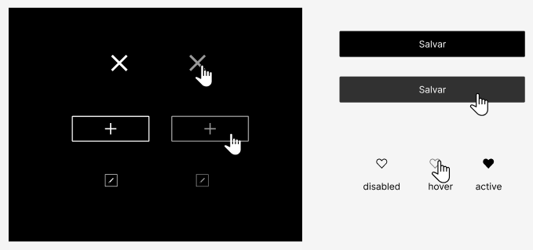
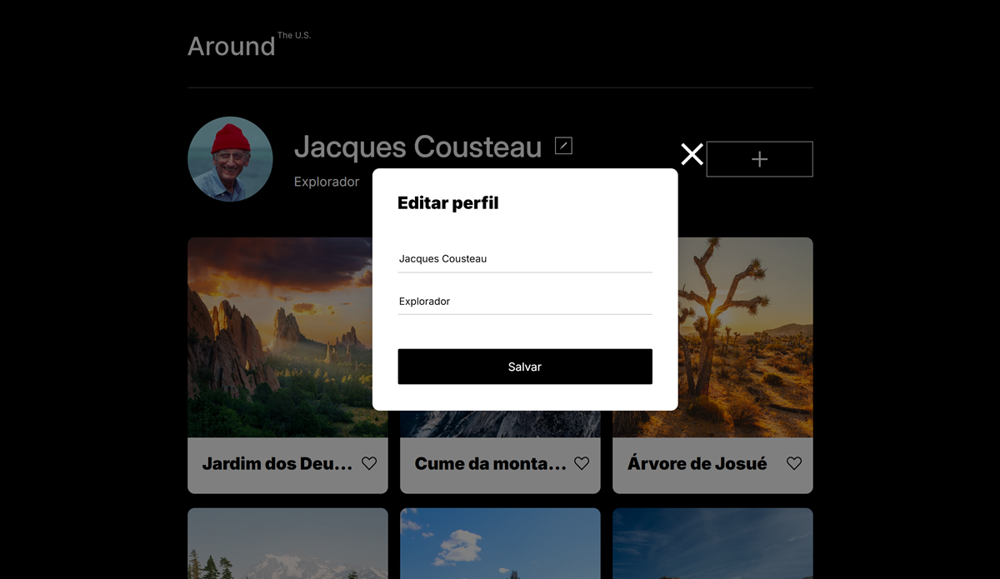
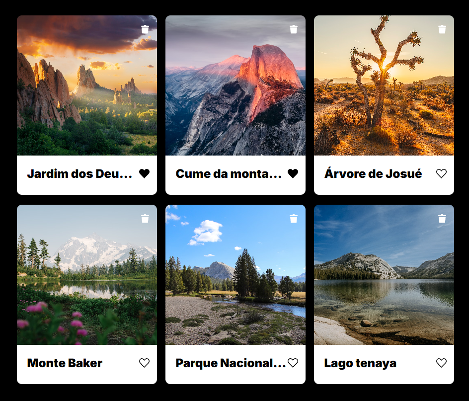
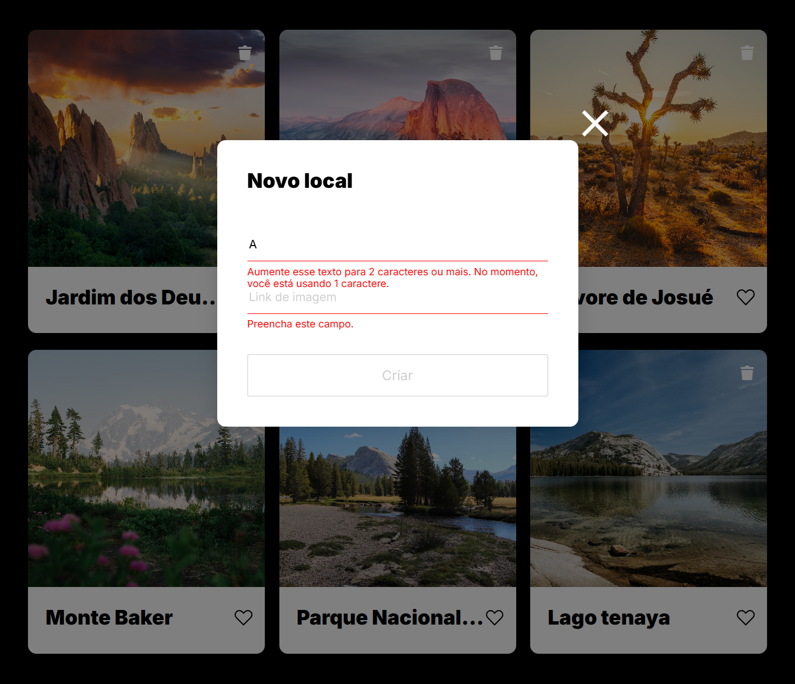
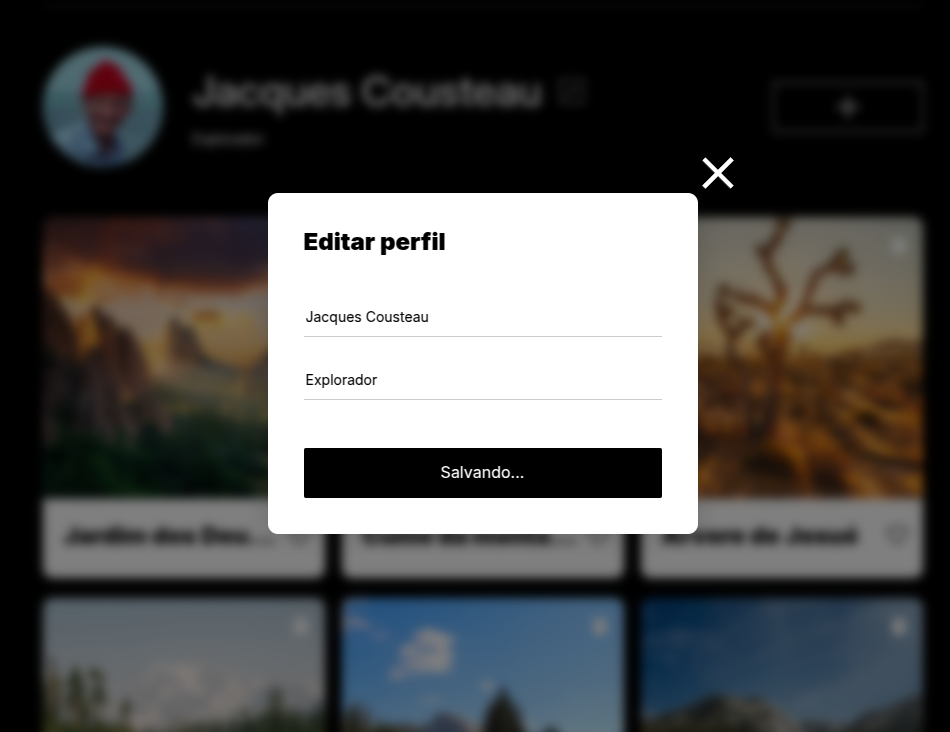
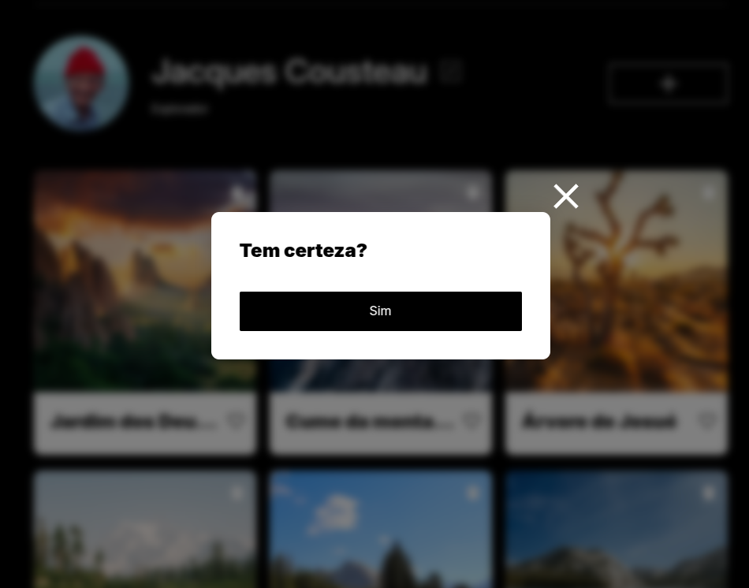

# Around the U.S. - EUA Afora

Este é um projeto da Around the U.S. - EUA Afora, destinado ao usuário para adicionar, remover ou curtir fotos. O layout é responsivo, adaptando-se a diferentes tamanhos de tela, utilizando `unidades de medida relativas` e `media queries` para ajustar o design conforme os pontos de interrupção, garantindo que o layout permaneça intacto e não quebre. Foi usado `JavaScript` para adicionar funções aos elementos da página e refactorado em modulos e classes facilitando o processo de manutenção e reusabilidade do código.

## Tecnologias

- HTML5 semântico
- Metodologia BEM
- Flexbox
- Grid
- Text-overflow
- Hover
- Pseudo-classe
- Unidades de medida relativas
- Media queries
- JavaScript
- API

## Descrição das Tecnologias e Técnicas Utilizadas

### HTML semântico

O `HTML semântico` foi aplicado para tornar o código mais compreensível.

### Metodologia BEM

A `metodologia BEM` facilita a manutenção e a compreensão do código.

### Flexbox

O `Flexbox` foi utilizado juntamente com `unidades de medida relativas` para organizar e otimizar a responsividade do layout.

### Grid e text-overflow

O `Grid` foi utilizado nos cartões das fotos da seção "gallery" para criar um layout mais organizado e melhor distribuído. A propriedade `text-overflow:ellipsis` foi aplicada em conjunto com `overflow:hidden` e `white-space: nowrap` para reduzir os textos que excedem o layout.

- Seção "Gallery"

### Pseudo-classe

Foi aplicada a pseudo-classe `:hover` para mudar o estilo na parte interativa quando o usuário passar o cursor sobre o elemento, e a pseudo-classe `:active` quando o elemento for clicado.

### Media Queries

As `media queries` foram implementadas para ajustar o layout de acordo com os pontos de interrupção e garantir a responsividade em várias resoluções de tela. Foram adicionados pontos de interrupção para assegurar a responsividade, definidos com base nos intervalos:

- 320-768px (590px, 650px)
- 768-1280px (785px)
- 1280px e acima

### JavaScript

No JavaScript foi utilizado o método `querySelector()` para selecionar os elementos e manipular o `DOM` adicionando o método `addEventListener()` aos botões para gerenciar as funções de abrir e fechar a popup para editar o perfil. A propriedade `textContent` foi usada para manipular e adicionar o conteúdo do perfil nos inputs quando abrir a popup, e exibir no perfil as alterações feitas no formulário após salvar, o mesmo foi aplicado para o formulário para adicionar novos cartões a galeria, foi usado o elemento `<template>` para criar o layout dos cartões, clonar com o método `cloneNode(true)` e adicionar o título e link da imagem passado através do formulário ao clone do cartão e adicionar o novo cartão ao topo da galeria usando o método `prepend()`.

- Popup para editar a seção "profile" e para adicionar novos cartões a seção da "gallery".

 

 

- Foi usado uma função para ativar o botão do like ao clicar e foi adicionado um botão com a função de remover o cartão desejado ao clicar.

 

- Foi usada uma função para verificar os cartões e caso não tenha nenhum cartão sera exibido uma mensagem.

 

- Foram usadas funções para validar os formulários e aprimorar a UX do popup, desabilitando o botão de `submit`, sublinhando de vermelho o `input` inválido e exibindo uma mensagem abaixo do `input` explicando o que está invalidando o formulário para que o botão de `submit` seja habilitado.

### API

Foi criado uma classe para API que permite interagir com dados externos, utilizando o método `fetch` atráves dos métodos de solicitações `GET`, `POST`, `PATCH`, `PUT` e `DELETE` para solicitar os dados do usuário ou dos cartões, alterar ou remover do servidor. E foram adicionado funções e métodos para interagir com o usuário indicando quando alguma solicitação está sendo processada.

- Fo adicionado método a classe da popup para alterar o botão de salvar indicando que está salvando e ao finalizar o processo vai voltar o texto padrão do botão e fechar a popup.

 

- Foi adicionado uma nova popup para fazer a confirmação da remoção do cartão, antes de enviar a solicitação de remoção pela API e remover da página.

#### Para ver o projeto em execução clique <a href="https://vinimello90.github.io/web_project_around/">aqui</a>.

## Planos de melhoria do projeto

- Sistema de login e autenticação de usuário.
