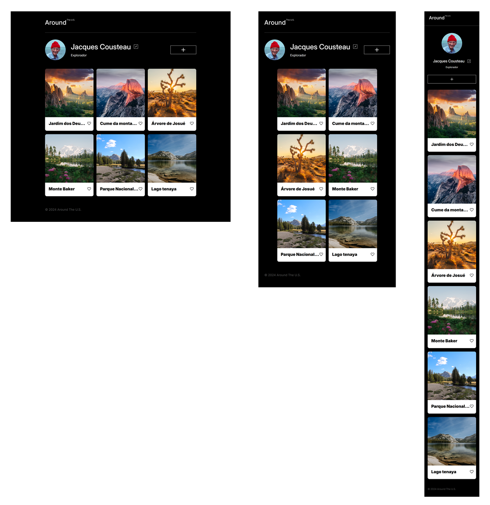

# Around the U.S. - EUA Afora

O projeto **Around the U.S. - EUA Afora** foi desenvolvido para permitir que o usuário adicione, remova ou curta fotos. Seu layout é responsivo, adaptando-se a diferentes tamanhos de tela por meio de **unidades de medida relativas** e **media queries**, ajustando o design conforme os pontos de interrupção, garantindo que o layout seja consistente e não quebre. O código foi escrito em **JavaScript**, e refatorado utilizando **módulos** e **classes** para facilitar a manutenção e reusabilidade do código.

**Veja o projeto em funcionamento clicando [aqui](https://vinimello90.github.io/web_project_around).**

## Tecnologias e Métodos

- HTML5 semântico
- Metodologia BEM
- Flexbox
- Grid
- Text-overflow
- Hover
- Pseudo-classes
- Unidades de medida relativas
- Media queries
- JavaScript
- API

## Descrição das Tecnologias e Técnicas Utilizadas

### HTML Semântico

O **HTML semântico** foi aplicado para tornar o código mais legível e acessível, melhorando a compreensão e a estruturação do conteúdo.

### Metodologia BEM

A **metodologia BEM** foi adotada para melhorar a manutenção e a escalabilidade do código, tornando a estrutura de classes mais clara e intuitiva.

### Flexbox

O **Flexbox** foi utilizado em conjunto com **unidades de medida relativas** para organizar o layout e otimizar a responsividade da página, garantindo uma boa experiência em diferentes dispositivos.

### Grid e Text-overflow

A propriedade `grid` foi usada para estruturar os cartões de fotos na seção **Gallery**, criando um layout bem distribuído. A propriedade **text-overflow: ellipsis** foi aplicada junto com `overflow: hidden` e `white-space: nowrap` para truncar textos que ultrapassam o limite do layout.

- Seção "Gallery"

  

### Pseudo-classes

As **pseudo-classes** `:hover` e `:active` foram aplicadas para melhorar a interatividade do site. A primeira altera o estilo dos elementos quando o cursor passa sobre eles, enquanto a segunda é ativada quando o elemento é clicado.

### Media Queries

As **media queries** foram configuradas para garantir que o layout se ajuste corretamente em diferentes resoluções de tela. Foram definidos os seguintes pontos de interrupção:

- 320-768px (590px, 650px)
- 768-1280px (785px)
- 1280px ou superior

  

### JavaScript

No **JavaScript**, foi utilizado o método `querySelector()` para selecionar elementos e manipular o **DOM**. Funções foram criadas para gerenciar eventos, como abrir e fechar popups para editar o perfil. Usou-se a propriedade `textContent` para manipular o conteúdo do perfil e exibir as alterações feitas pelo usuário.

- **Popup para editar perfil** e adicionar novos cartões à **Gallery**:

   
  

Além disso, implementaram-se funcionalidades como:

- Ativar/desativar o botão de **like** ao clicar.
- Remover cartões com a funcionalidade de botão.

  

- Exibição de uma mensagem caso não haja cartões na galeria.

  

- Validação de formulários para melhorar a **UX** no popup exibindo uma mensagem de erro abaixo do **input** e com o botão **submit** sendo habilitado somente quando o formulário estiver válido.

  

### API

Foi criada uma classe para interagir com a **API**, permitindo realizar solicitações **GET**, **POST**, **PATCH**, **PUT** e **DELETE** para obter, adicionar ou modificar dados no servidor. A autenticação é feita por meio de um **token**.

Funções adicionais foram implementadas para melhorar a experiência do usuário, como:

- Alterar o texto do botão de **salvar** indicando o processo de salvamento e restaurá-lo ao seu estado original após a conclusão.

  

- Uma popup de confirmação foi adicionada para a remoção de cartões, solicitando confirmação antes de enviar a solicitação à API.

  

## Planos de Melhoria do Projeto

- Implementação de um sistema de **login** e **autenticação de usuário**.
