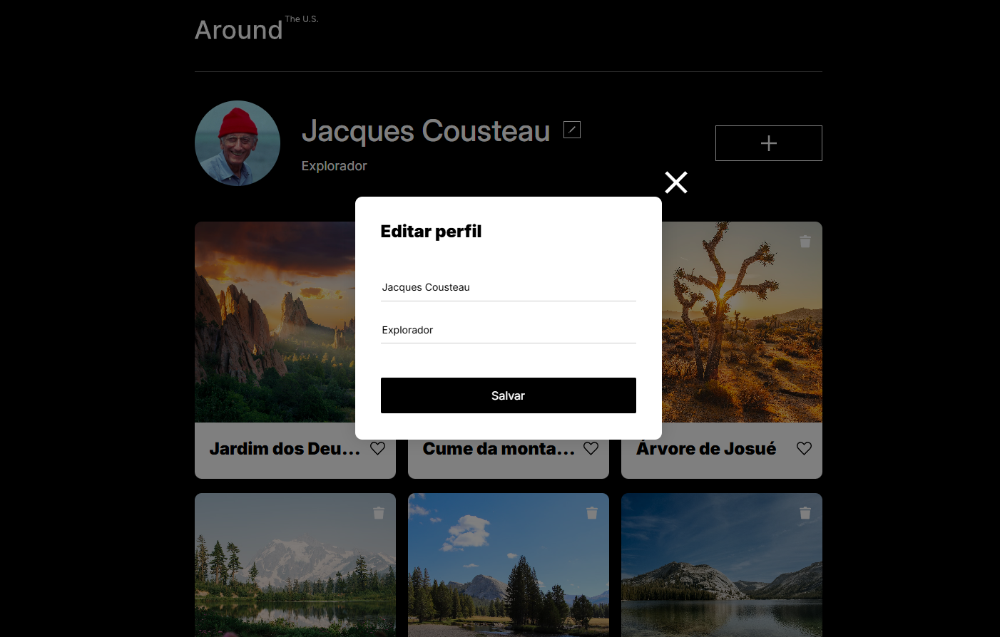

# Around the U.S. - EUA Afora

Este é um projeto da Around the U.S. - EUA Afora, destinado ao usuário para adicionar, remover ou curtir fotos. O layout é responsivo, adaptando-se a diferentes tamanhos de tela, utilizando `unidades de medida relativas` e `media queries` para ajustar o design conforme os pontos de interrupção, garantindo que o layout permaneça intacto e não quebre. Foi usado `JavaScript` para adicionar funções aos elementos da página.

## Tecnologias

- HTML5 semântico
- Metodologia BEM
- Flexbox
- Grid
- Text-overflow
- Hover
- Pseudo-classe
- Unidades de medida relativas
- Media queries
- JavaScript

## Descrição das Tecnologias e Técnicas Utilizadas

### HTML semântico

O `HTML semântico` foi aplicado para tornar o código mais compreensível, enquanto a `metodologia BEM` facilita a manutenção e a compreensão do código.

### Flexbox

O `Flexbox` foi utilizado juntamente com `unidades de medida relativas` para organizar e otimizar a responsividade do layout.

### Grid e text-overflow

O `Grid` foi utilizado nos cartões das fotos da seção "gallery" para criar um layout mais organizado e melhor distribuído. A propriedade `text-overflow:ellipsis` foi aplicada em conjunto com `overflow:hidden` e `white-space: nowrap` para reduzir os textos que excedem o layout.

- Seção "Gallery"

### Pseudo-classe

Foi aplicada a pseudo-classe `:hover` para mudar o estilo na parte interativa quando o usuário passar o cursor sobre o elemento, e a pseudo-classe `:active` quando o elemento for clicado.

### Media Queries

As `media queries` foram implementadas para ajustar o layout de acordo com os pontos de interrupção e garantir a responsividade em várias resoluções de tela. Foram adicionados pontos de interrupção para assegurar a responsividade, definidos com base nos intervalos:

- 320-768px (590px, 650px)
- 768-1280px (785px)
- 1280px e acima

### JavaScript

No JavaScript foi utilizado o método `querySelector()` para selecionar os elementos e manipular o `DOM` adicionando o método `addEventListener()` aos botões para gerenciar as funções de abrir e fechar a popup para editar o perfil e exibir uma mensagem quando a galeria de cartões estiver vazia. A propriedade `textContent` foi usada para manipular e adicionar o conteúdo do perfil nos inputs quando abrir a popup, e exibir no perfil as alterações feitas no formulário após salvar.

- Popup para editar a seção "profile".

 

- Mensagem exibida quando a galeria de cartões estiver vazia.

#### Para ver o projeto em execução clique <a href="https://vinimello90.github.io/web_project_around/">aqui</a>.

## Planos de melhoria do projeto

- Adicionar função para adicionar e remover os cartões.
- Adicionar função ao botão de "curtir".
